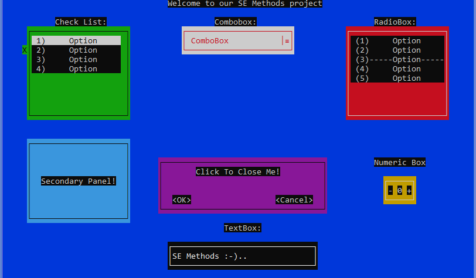

# SE Methods 2020

# Description

Built in I/O directory for windows console.

This is the final project of "Methods in Software Engineering" course.
 
You can use either mouse and keyboard for controlling the controllers

# Controls Specification

**SE Methods Final Project**  

**Panel**  

**Label**  

**TextBox**  

**MessageBox**  

**RadioBox**  

**CheckList**  

**ComboBox - Close**  

**ComboBox - Open**  

**NumericBox**   

